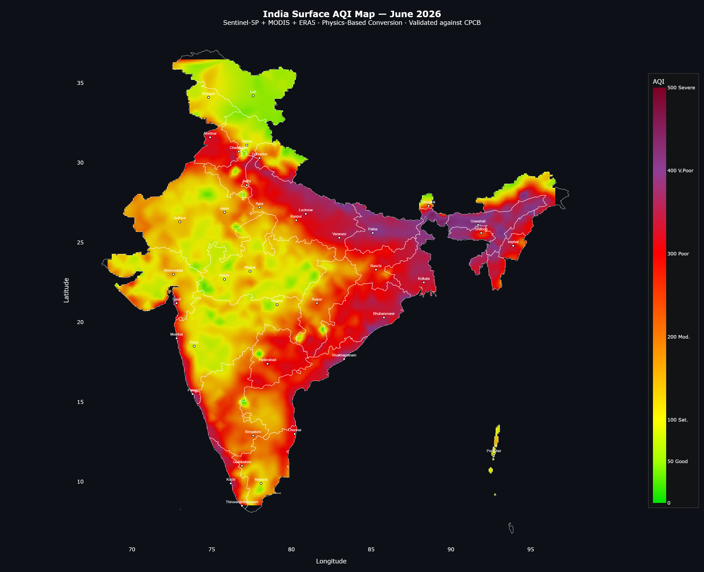
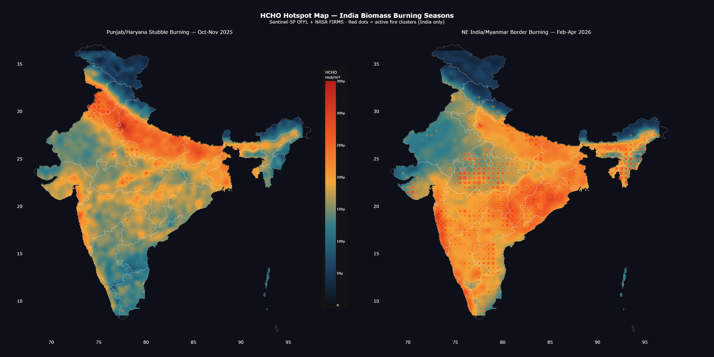

# ISRO BAH 2026 — Surface AQI + HCHO Hotspot Detection

**Team:** SpaceAlpha | AISSMS Institute of Information Technology, Pune

## Outputs

### Surface AQI Map (March 2026)

### HCHO Hotspot Map — Both Burning Seasons

## Stack
Sentinel-5P · MODIS · ERA5 · NASA FIRMS · Google Earth Engine · Python

## Run
`bash
pip install -r requirements.txt
python pipeline/fetch_recent_physics.py
python pipeline/visualize_final.py
`

See [docs/methodology.md](docs/methodology.md) for full technical details.
